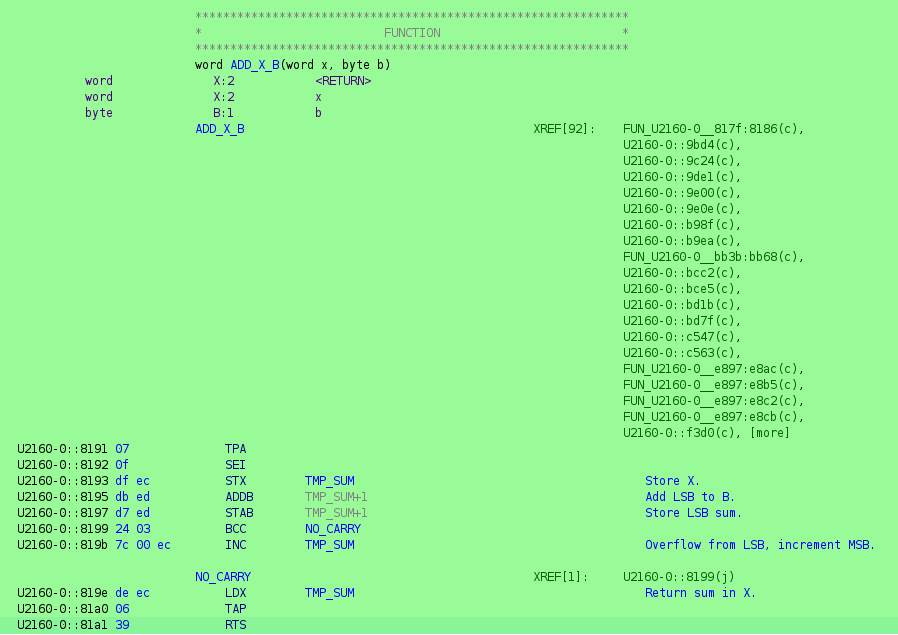

# GhidraTek2465

A Ghidra extension for the venerable Tektronix 2465-series oscilloscopes.



## Features

* MC6800 and MC6801 language specs for Sleigh.
* ROM loader for the 2465 series.
  - The original 2465.
  - The 2465A/2467.
  - The 2465B/2467B early models with through-hole A5 board.
  - The 2465B/2467B late models with SMD A5 board.
* Creates typed memory blocks for the IO.

  This aids analysis as it makes it easy to track down users of different registers
  using the cross-reference tables Ghidra builds.
  Also note that different scope versions have different IO register layouts.
  
* Creates typed symbols for the ROM headers
* Tags the code pointed to by the vector table as functions for analysis.

  This gives the auto analysis a starting points for disassembly and function discovery.
  
* Analyzes banking thunks.

  This propagates the disassembly across banks, which allows even more code discovery
  in auto analysis.
  
* Sets the destination of a banking thunk to the service function.

  This aids analysis as when the decompiler encounters a thunk, it displays
  the ultimate destination of a thunk or a series of thunks, rather than
  showing the thunk as the destination.

* Marks known (banking) functions at load time.

  For know ROM part number/version combos, this fully automates the initial
  auto analysis. Note that it may be necessary to initiate auto analysis
  a couple of times due to the way the analyzer works.

## How to install
1. Download a [prebuilt GhidraTek2465 release](https://github.com/sigurasg/GhidraTek2465/releases), or build it yourself.
1. Start Ghidra
1. File -> Install Extensions
1. Press the plus icon ("Add extension")
1. Choose the built or downloaded GhidraBoy zip file
1. Restart Ghidra when prompted to load the extension properly

## How to build

As a prerequisite, you need to have a Ghidra installation somewhere (an actual
installation, not a copy of Ghidra source code!).

```
export GHIDRA_INSTALL_DIR=/path/to/ghidra
./gradlew
```

or

```
./gradlew -Pghidra.dir=/path/to/ghidra
```

You can then find a built extension .zip in the `dist` directory.

## License

Licensed under the Apache License, Version 2.0.
